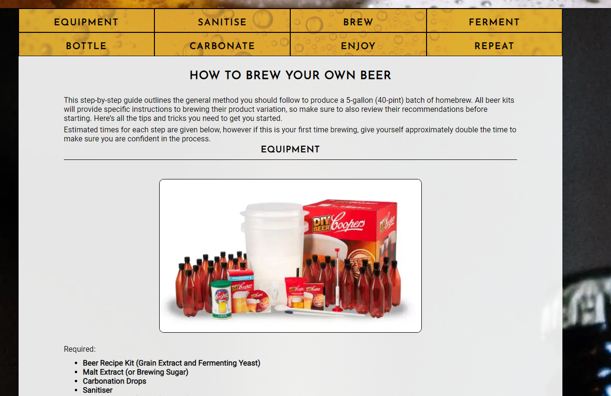

# Apprentice Brewing

## Site Overview
Apprentice Brewing was founded to educate and engage people in the creative world of homebrewing. Users of the site will be able to discover the process and methods of brewing beer at home, explore the available products and retailers specialising in homebrew equipment and learn tips from experienced brewers through tutorial videos.

## Contents
1. [Site Overview](#site-overview)
1. [Planning Stage](#planning-stage)
    * [Target Audience](#target-audience)
    * [User Stories](#user-stories)
    * [Colour Scheme](#colour-scheme)
1. [Features](#features)
    * [Navigation](#navigation)
    * [Introduction](#introduction)
    * [Contact Form](#contact-form)
    * [Animations](#animations)
    * [Brewing Guide](#brewing-guide)
    * [Recommended Resources](#recommended-resources)
    * [Tutorial Videos](#tutorial-videos)
1. [Future Enhancements](#future-enhancements)
1. [Technology Used](#technology-used)
1. [Testing](#testing)
    * [Validator Testing](#validator-testing)
1. [Deployment](#features)
1. [Credits](#features)
    * [Content](#features)
    * [Media](#features)

## Planning Stage

### Target Audience
* User who have never brewed beer before and are interested in trying it for the first time.
* Users who have brewed beer before or who are experienced brewers who want to learn additional tips to the brewing process.
* Users who want to learn about the process of brewing beer at home.
* Users who want to explore the product market for homebrew beer kits.
* Users who want to contact an organisation with questions regarding homebrewing beer.

### User Stories
* As a user, I want to see the subject matter of the page.
* As a user, I want to navigate quickly and easily through the page to find what I require.
* As a user, I want to leave the website more knowledgable than before visiting the site and be satisfied with my overall experience.
* As a user, I want to easily access additional resources for further personal research.
* As a user, I want to connect with the organisation, have the ability to ask questions and to stay up to date with company news. 

### Colour Scheme
* The site's main colours of black, white and gold were chosen to mimic the golden colours in a pint of lager within the dim setting of a pub.
* A colour grid was created to evaluate appropriate colour pairings using the [Eight Shapes Color Grid](https://contrast-grid.eightshapes.com/?version=1.1.0&background-colors=&foreground-colors=%23ffffff%0D%0A%23000000%0D%0A%23daa520%0D%0A&es-color-form__tile-size=compact&es-color-form__show-contrast=aaa&es-color-form__show-contrast=aa&es-color-form__show-contrast=aa18&es-color-form__show-contrast=dnp)
* From this it was decided that all fonts would be kept black upon either white or golden background colours in order to provide sufficient contrast for the users. The inversion was also used to highlight active classes or upon hovering over elements.

## Features

### Navigation
* The navigation bar shows the three main pages of the website which assist the user with smoot navigation. The header is consistent throughout all pages and is fixed to the top of the screen, meaning users can navigate to different pages easily.
* The submenus in the Brew and Resources pages allow the user to skip to the section they desire to view without manually scrolling themselves.
* Throughout the website there are several anchor elements which redirect the user to relevant pages and sub-sections of the website. For example in the introduction, several pages and sections within the website are hyperlinked within the paragraph to quickly redirect the user. The the text is underlined upon hovering the cursor over the hyperlinks to indicate to the user that it is an active link.  
* There is also a 'Return To Top' button at the bottom of the page to save the user from scrolling back up to the top of the page.

### Introduction
* Users are welcomed to the site by an introduction to the Apprentice Brewing organisation and a small gallery of homebrew beer to encourage curiosity for the user to explore the site more.

### Contact Form
* The contact from enables users to contact us with any questions they may have about brewing or the organisation. They also have the option to join the mailing list to stay informed on company updates and recommendations.
* The background image of people laughing and enjoying a beer expresses the company's desire to connect with their user community and encourages the user to get in touch.  

### Animations
* Hero Image Zoom
This is the first thing the user will see on the site as the image is animated to zoom in 10% upon loading the page.
* Submenu Pan
The submenus are designed with a background image of the carbonation bubbles within a beer. Upon loading the pages the image scrolls from the top of the image to the bottom, giving the impression that the bubbles are rising through the menu.  

### Brewing Guide
* The Equipment section provides direct hyperlinks to each product. This allows the user to familiarise themselves with what product looks like, and with a recommendation of a cheap option for each product should they wish to buy them.

### Recommended Resources
* The resources section offer the user with products and information for them to explore to get started. Four key retailers are recommended, which vary in price and quality, so that a wide budget range is covered.
* Users can click on each retailer anchor block to be redirected to their respectivel websites. Each website opens in a new tab to keep the user's position on our website to easily return to the resources page later. 

### Tutorial Videos
* The tutorial videos allow users to visually learn from expert brewers and beer enthusiasts to accelerate their knowledge of brewing processes and technques. Users can choose to open the videos externally on the Youtube in another tab by clicking the integrated 'Watch on YouTube' button.

## Future Enhancements
Various additional features would bring a greater user experience to the website: 
* The addition of a dedicated 'Tips' webpage would enable brewers to build upon their base knowledge by learning concepts including how to improve their process in brewing, the taste of their beer, and how to experiment with new flavours.
* The addition of user feedback through comments sections would allow for continual site improvement and additional perspectives from fellow brewers.
* The addition of a user up/down-voting system on the recommended products would help users to make an informed decision on what to buy by considering the recommendations of the site users.

## Technology Used

* HTML & CSS programming languages
* [Google Fonts](https://fonts.google.com/) - 'Josefin Sans' & Roboto Styles
* [Font Awesome](https://fontawesome.com/) - Social Media Logos
* [GitPod](https://www.gitpod.io/) - IDE for local developement
* [GIT](https://git-scm.com/) - Version Control
* [GitHub](https://github.com/) - to host the repositories for this project and the live website preview

## Testing

**Implementation 🏭**: When i had set up the products fixtures and loaded into the database i could then view all saleable items in the store, i wanted to ensure all products loaded as expected and that item information was visable when selected.

Test 🧪: To test this, I went through each item and loaded the products information page, then looked at changing the url to ensure each item was loading correctly

Result 🏆: All products loaded as expected to the main store page, some items were missing their images but they were still selectable and loaded their page correctly. When amending the url all items again loaded as expected however if i tried to access an item id that didn't exist i was presented with a 404 page.

Verdict ✅: This test passed in it's basic form, amendments are required to the fixtures to ensure all the items images load correctly, also as the 404 page is the generic template provided with Django creating a custom page to handle these errors is desireable.

* All links and images on the website work correctly and all elements are responsive to screen size.
* All embedded videos play within the site when clicked and successfully redirect to the Youtube site when requested. 
* The website was tested across various browsers, including Google Chrome, Mozilla Firefox and Microsoft Edge.
* The website was responsive across screen sizes between 320px and 1600px in width. Content readablility was optimised by altering the size and positioning of elements. The Developer Tools function was used to test this across Google Chrome, Mozilla Firefox and Microsoft Edge to verify the site was fully responsive across the specificed screen witdhs and across different browsers.

### Validator Testing
* **HTML**
    * No errors were found when running the html code through the [official W3C validator](https://validator.w3.org/)
* **CSS**
    * No errors were found when running the css code through the [official W3C Jigsaw validator](https://jigsaw.w3.org/css-validator/)
* **Accessibility**
    * The website was tested using the Lighthouse function in Chrome DevTools, showing a very high level of accessibility.

## Deployment
The site was deployed to GitHub pages. The steps to deploy are as follows:

1. In the GitHub repository, navigate to the repository for apprentice-brewing and then click on the Settings tab.
1. Click on the Pages tab from the list of options on the left hand side of the page.
1. Under Source click the drop-down menu labelled None and select main as the branch.
1. Once saved the link to the page will be provided above the ‘Source’ sub-section upon refreshing.
1. The live link can be found here - https://bens6477.github.io/apprentice-brewing/

## Credits

### Content
* All content was written by myself, taking inspiration from the following sources:
    * [Northern Brewer - How to Make Beer](https://www.northernbrewer.com/blogs/new-to-brewing-start-here/how-to-brew-beer-homebrewing-101)
    * [Kegregator - How to Brew Beer: The Ultimate Step-by-Step Guide](https://learn.kegerator.com/how-to-brew-beer/)
    * [Adventures in Homebrewing - How to Make Your Own Beer]()
    * [Balliihoo - Basic Guide to Making Beer from a Kit](https://www.balliihoo.co.uk/images/bradweb/downloads/balliihoo_leaflet.pdf)
* The icons in the footer were taken from [Font Awesome](https://fontawesome.com/)
* All fonts were imported from [Google Fonts](https://fonts.google.com/)

### Media
* The background and hero images were taken from - https://www.pexels.com/
* The tutorial videos were taken from:
    * [How to make great tasting beer at home.](https://www.youtube.com/watch?v=T1l1oCyCZKo)
    * [Coopers Lager 40 Pint Home Brew Beer Kit, our experience - Part 1](https://www.youtube.com/watch?v=SkpxH7FxLxU)
    * [A Guide To Siphoning](https://www.youtube.com/watch?v=bYnQmyGlotQ)
* The code to make the videos responsive was found at - https://www.smashingmagazine.com/2014/02/making-embedded-content-work-in-responsive-design/
* The CSS to pan across the beer bubbles background image was taken from - https://stackoverflow.com/questions/33835096/css-to-pan-background-image-back-and-forth
